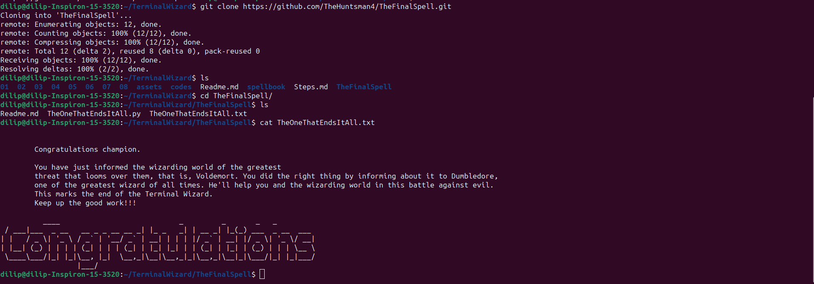

## Commands Used

## linux commands

### cd (Change Directory)
TO navigate to required directory .
### cd ..
To exit from current directory.
### ls
list of files in the current directory.
### cat <file name>
to read the content inside a file. 
### cat >file name
to create and add content to the file.
### cp
copy files from one directory to another directory.
### echo 
I have used it to decode the string of finalcode.
### pwd (Present working directory)
present working directory gives root of the current directory.
### mkdir 
Create a new directory.
### rmdir
remove the directory.
### rm 
To remove a file.

## git commands

### git add *
To add all the files in the cloned git repositery from the directory.
### git commit -m
To commit all files.
### git status
To check status of files .
### git push origin main
pushes the files to cloned github.
### git branch
shows all the branches which are not hidden.
### git branch -a
Shows all the branches inculding hidden branches.
### git checkout <branchname>
To get out of current branch.
### git checkout <remote branch> <place/pathof the file>
To copy a file or directory from one branch to another branch.
### git clone <url>
clones the git repository to local server .

